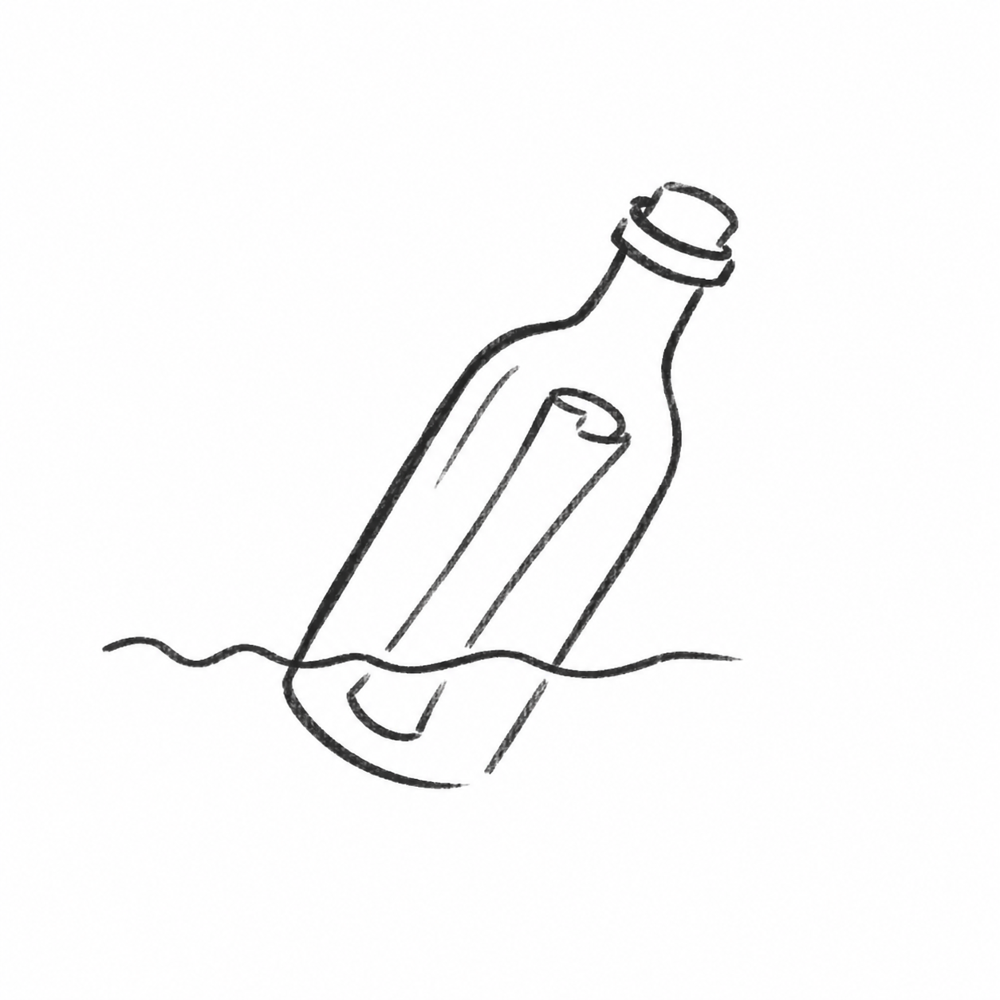

<p align="center">
  
</p>

<h1 align="center">Bottle</h1>

<p align="center">
  <em>A message in a bottle: something you write for a future reader you will never meet in person.</em>
</p>

<p align="center">
  
  
</p>

Every [Claude Code](https://claude.com/claude-code) session starts from zero. That is the part that really costs you time. Claude can read your whole codebase in seconds, but it does not remember what an earlier session already tried, fixed, or learned the hard way. So the same bugs come back, and you answer the same questions twice. Bottle fixes this with a few small markdown files that every new session reads first. They are short enough to read in full, so nothing important gets lost, and you never have to explain it all again.

This is what makes it possible to build something big through normal conversation, not just quick one-off edits. You describe what you want in everyday language, and Claude can carry a real, multi-step project forward across many sessions, while you stay in charge: you see the plan, you approve the direction, and you decide what happens next, instead of losing track of the project or re-explaining it every time. Write down one big, messy request, and Claude splits it into separate, simpler tasks on its own, so nothing gets lost inside one oversized item.

This is the difference between vibecoding and real engineering: not just prompting your way to something that happens to work and hoping you remember why, but real tracked requirements, a real changelog, and a real roadmap, a written record you can check the project against instead of just a feeling that it's fine.

## Get started in one minute

```
/plugin marketplace add Simooo45/bottle
```
```
/plugin install bottle@bottle
```

Send these as **two separate messages**. The install only works once the first message has landed. Then just say what you want:

> "Set up session continuity for this project"

and Claude will use the skill on its own, or you can call it directly with `/bottle:bottle`. Prefer not to touch the plugin system at all? Go to [manual install](#manual-install-no-plugin-system), it is just one `cp` command.

## Before / after

**Without Bottle**
> "I already told you not to put dates in code comments." You did, back in session 12. Session 45 writes a fresh comment with today's date in it, no memory of ever being told otherwise.

**With Bottle**
> Session 45 reads `RULES.md` before writing a line of code. Rule 7: no dates in comments. Claude never has to be told twice.

## The problem

A coding session needs two things at the same time. The context window has to stay small. But the session also needs to remember what past sessions learned, or it repeats the same mistakes and asks the same questions again. Chat history does not survive a restart. And one giant `NOTES.md` file does not survive its own success either: it just keeps growing until reading all of it costs more than it is worth.

Bottle splits project documentation into two levels: a small set of files, with a size limit, read in full every session; and archive files that grow without limit and are only ever searched, never read in full. The full reasoning lives in [SKILL.md](SKILL.md).

## The file set

Eight files. Each one has exactly one job, nothing shared, nothing overlapping:

| File | Tier | Purpose |
|---|---|---|
| `RULES.md` | small, full read every session | Standing rules that are always true |
| `MESSAGE_IN_A_BOTTLE.md` | small, full read every session | Free-form note from one session to the next |
| `PLAN.md` | small, full read when relevant | Long-term roadmap, in phases |
| `BACKLOG.md` | small-ish, full read before new work | Current requirements as a checklist |
| `BACKLOG_HISTORY.md` | archive, never read in full | Requirements closed more than a week ago |
| `TEST.md` | small-ish, read before touching a tested area | Manual tests Claude cannot check itself, written as a TODO list, linked to a requirement |
| `TEST_HISTORY.md` | archive, never read in full | Tests closed more than a week ago |
| `CHANGELOG.md` | archive, never read in full | Full change history, most recent first |

A small script with no dependencies (`scripts/age-backlog.mjs`) keeps `BACKLOG.md` (and `TEST.md`, if you have it) from filling back up with closed items. Claude offers to copy it into your project during setup, and runs it automatically at the start of every session (RULES.md rule 0), so nobody has to remember to run it by hand.

Every generated `RULES.md` includes two default rules, and these are not just suggestions: source files have a limit of 500 lines, and `MESSAGE_IN_A_BOTTLE.md` gets a full rewrite, down to under 100 lines, the moment it would go past 200, instead of being trimmed line by line. Both rules exist for the same reason as the rest of Bottle: a file nobody can read in full stops being useful, whether it is docs or code. I learned that one the slow way.

## Works even when Claude doesn't

**`BACKLOG.md` is plain markdown in your own repo, not a Claude-only format.** Maybe your credits run out, your subscription lapses, or you just don't have Claude open. You do not have to stop: open `BACKLOG.md` in any text editor and add new requirements by hand, in the "To triage" section, using whatever shorthand you like. You do not need to match the ID, priority, or date format yourself. The next time Claude reads `RULES.md` (rule 0, every session), it turns everything you added into the standard format and picks the project back up exactly where you left it. This is one of the main reasons this system exists: your project's memory never depends on Claude being available.

## What to expect

This is not a "generate six files and walk away" skill. The file set can look strange the first time you see it, so Claude asks you a few short questions first, about the project's scope, language, and any standing rules, and explains what each file is for *before* creating it, checking in with you as it goes instead of giving you everything at once. Expect a short, guided conversation the first time you run this in a project, not a silent file drop.

## Manual install, no plugin system

Skills work the same way, whether they come from a plugin or sit directly in a skills folder:

```bash
git clone https://github.com/Simooo45/bottle.git
cp -r bottle ~/.claude/skills/bottle   # available in every project
# or
cp -r bottle .claude/skills/bottle     # this project only
```

Call it with `/bottle`.

## License

MIT — see [LICENSE](LICENSE).
